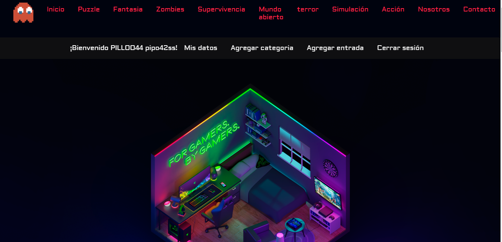
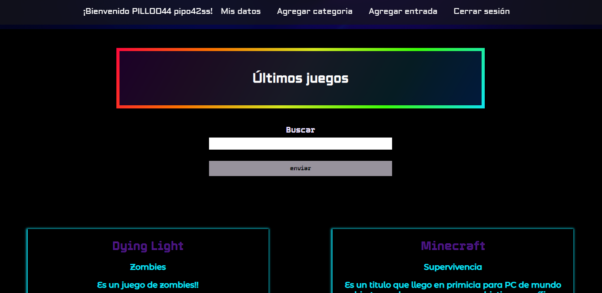
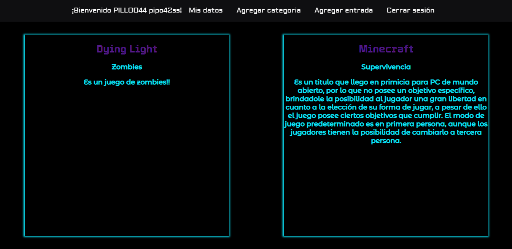
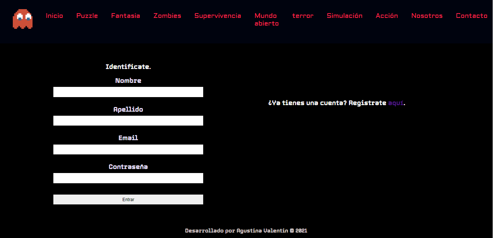

# Proyecto sitio web blog de videojuegos.

## Breve descripción:

El proyecto está bastante funcional gracias a pequeños detalles como tocar los nombres de los juegos y abrir una vista completa con más datos del mismo, tocar categorias y mostrar los juegos pertenecientes, etc. También cuenta con el registro de usuarios conectado a la base datos y la información de los juegos también sacada de allí.

## Trabajo con base de datos

Aquí encontramos un CRUD donde el usuario puede crear entradas y categorias además de borrarlas y editarlas (siempre y cuando sea sean suyas y esté registrado).

## Cosas a mejorar

    Próximamente tendrá javascript y mejoras en los estilos.

## Fotos del sitio web funcional

      Aclaración: recordar que github no ejecuta el backend! Por eso adjunto fotos. Fecha: 28/07/21

